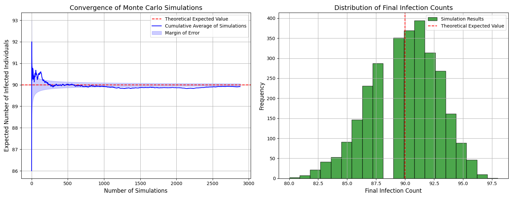

# Pandemic Simulator


**[View the Full Project Report (PDF)](report/project_report.pdf)**

This project provides a dual-approach analysis of infectious disease dynamics within a population. It contrasts a deterministic theoretical model, which calculates the exact expected outcome, with a stochastic Monte Carlo simulation, which validates the results empirically.

## Key Features

-   **Theoretical Modeling:** Calculates the precise expected value of infected individuals after a set number of days using probability theory and matrix exponentiation.
-   **Monte Carlo Simulation:** Simulates the day-by-day probabilistic interactions of individuals to approximate the real-world evolution of the pandemic.
-   **Statistical Validation:** Uses Chebyshev's inequality to determine the exact number of simulations required to achieve a high degree of statistical confidence (95% confidence with an error margin of 0.25).
-   **Data Visualization:** Includes logic to generate plots that visually confirm the simulation's convergence to the theoretical value, demonstrating the Law of Large Numbers.

## Methodology

The project is structured into two distinct Python scripts that work in tandem.

### Part 1: `theoretical-model.py`

This script serves as the analytical core of the project. It does not run any random simulations; instead, it uses a deterministic mathematical model to compute the exact answer.

1.  **Transition Matrices:** It constructs two matrices using binomial probabilities:
    -   An **Infection Matrix (`inf`)**: The probability of transitioning from `i` to `j` infected people during the morning infection phase.
    -   A **Healing Matrix (`heal`)**: The probability of transitioning from `i` to `j` infected people during the evening recovery phase.
2.  **Daily Projection:** These are multiplied (`dp = inf * heal`) to create a single-day transition probability matrix.
3.  **Final Distribution:** The daily matrix is raised to the power of the total number of days (`Z`) to find the final probability distribution of all possible outcomes.
4.  **Key Outputs:** The script calculates and prints two crucial values:
    -   The **exact expected value** of infected individuals.
    -   The **required number of simulations (`R`)** needed for the Monte Carlo model to achieve statistical significance.

### Part 2: `monte-carlo-simulation.py`

This script runs the stochastic simulation to validate the theoretical findings.

1.  **Simulation Loop:** It runs `R` independent simulations, where `R` is the number determined by the `theoretical_model.py` script.
2.  **Daily Process:** For each day within a simulation, it models:
    -   **Infection:** Every pair of healthy and infected individuals meets, and a random event determines if an infection occurs based on probability `p`.
    -   **Recovery:** Every infected individual has a chance to recover based on probability `q`.
3.  **Aggregation & Visualization:** After all simulations are complete, the script calculates the average number of infected individuals. This average should converge to the expected value from Part 1. It can also be extended with `matplotlib` to plot the results.

## Results and Validation

The model's robustness is confirmed by the simulation's output. The running average of the Monte Carlo simulation converges precisely to the deterministic expected value calculated by the theoretical model, providing a powerful visual confirmation of the Law of Large Numbers.


*Left: The running average of infected cases converges to the theoretical expected value. Right: A histogram showing the frequency distribution of outcomes across all simulations.*

## Setup and Usage

**1. Prerequisites:**
-   Python 3.x
-   Pip

**2. Clone the repository:**
```bash
git clone https://github.com/CezarTulceanu/Pandemic-Simulator.git
cd Pandemic-Simulator/code
```

**3. Install dependencies:**
```bash
pip install numpy scipy matplotlib
```

**4. Follow the two-step workflow:**

### Step 1: Run the Theoretical Model

First, configure the parameters (population, initial cases, etc.) inside `theoretical_model.py`. Then run it to calculate the exact expected value and the required number of simulations.

```bash
python theoretical_model.py
```
Note the two numbers in the output. They will be the input for the next step.

**Example Output:**
```
Expected number of infected people: 25.135
Required number of simulations: 15420
```

### Step 2: Run the Monte Carlo Simulation

Now, open `monte_carlo_simulation.py` and update its parameters to match the first script. Crucially, set the `num_simulations` variable to the value you obtained from Step 1.

```python
# Inside monte_carlo_simulation.py
num_simulations = 15420 # <-- Update this value
# ... other parameters ...
```

Run the script to start the simulation.
```bash
python monte_carlo_simulation.py
```
The final average printed by this script should be extremely close to the expected value calculated in Step 1.
